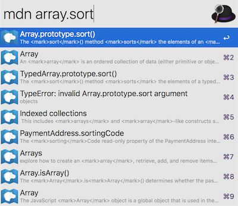

# arvis-mdn
> Search through the MDN documentation




## Install

```
$ npm install -g arvis-mdn
```


## Usage

In arvis, type `mdn`, <kbd>Enter</kbd>, and your query.

Select an item and press <kbd>Enter</kbd> to go to its [MDN](https://developer.mozilla.org/en-US/) documentation.


## License

MIT © [Klaas Cuvelier](https://klaascuvelier.io)


## 🔗 This workflow is converted from [alfred-workflow](https://github.com/klaascuvelier/alfred-mdn).

* Note that there might be some code change or different actions from the original workflow.

* Marked original workflow's creator to author.
